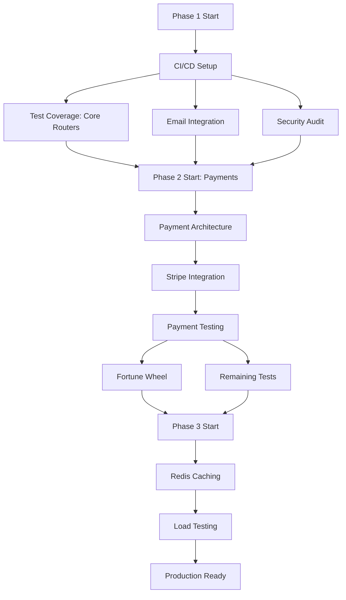

# Casino Royal SaaS - PM Execution Plan

**Project Manager:** SuperClaude PM Agent
**Generated:** 2025-11-20
**Project Status:** 75% Complete → 100% Target
**Timeline:** 9 weeks (3 phases)
**Team Size:** 2 developers recommended

---

## 🎯 Executive Summary for Stakeholders

### Current State
Your Casino Royal SaaS platform has **excellent foundations** but needs **critical quality gates** before production launch.

**What's Working (75%):**
- ✅ Core backend: 16 API routers, ~100 endpoints
- ✅ Security: JWT auth, bcrypt, rate limiting (9/10 score)
- ✅ Real-time: WebSocket chat with typing indicators
- ✅ Database: PostgreSQL with migrations, connection pooling
- ✅ Infrastructure: S3 storage, monitoring, health checks

**What's Blocking Production (25%):**
- ❌ **Test Coverage: 5%** (only 1 of 16 routers tested)
- ❌ Email: Mock SMTP (prints to console)
- ❌ Payments: Read-only (no transaction processing)
- ❌ CI/CD: No automated testing/deployment
- ⚠️ Fortune Wheel: Mentioned in README but missing

### Risk Assessment

| Risk | Impact | Probability | Mitigation |
|------|--------|-------------|------------|
| Production bugs without tests | CRITICAL | High | Phase 1 test coverage |
| Revenue blocked (no payments) | HIGH | Certain | Phase 2 Stripe integration |
| Manual deployment errors | MEDIUM | Medium | Phase 1 CI/CD setup |
| Email verification fails | HIGH | Certain | Phase 1 SMTP integration |
| Feature parity (Fortune Wheel) | LOW | Low | Phase 2 implementation |

### Recommended Path Forward

**Option 1: Fast Track to Production (6 weeks, $19,800)**
- Focus on critical blockers only
- Skip Fortune Wheel (document removal from README)
- Minimum 70% test coverage
- Basic payment processing

**Option 2: Complete Feature Set (9 weeks, $26,325)** ⭐ RECOMMENDED
- All blockers resolved
- Complete feature parity with README
- 80%+ test coverage
- Full payment processing + Fortune Wheel

**Option 3: Production + Scale (12 weeks, $36,000)**
- Everything in Option 2
- Redis caching layer
- Performance optimization
- Advanced security features

---

## 📋 Phase-Based Execution Plan

### Phase 1: Production Readiness (2-3 weeks, 75 hours)

**Goal:** Resolve critical blockers preventing production launch

**Success Criteria:**
- [ ] Test coverage ≥ 70%
- [ ] Real SMTP email verification working
- [ ] CI/CD pipeline operational
- [ ] Security audit passed
- [ ] .env.example documented

#### Week 1: Quick Wins & Infrastructure

**Sprint 1.1: Documentation & CI/CD (16 hours)**

| Task | Owner | Hours | Priority | Dependencies |
|------|-------|-------|----------|--------------|
| Create .env.example with all variables | Backend | 1 | P0 | None |
| Setup GitHub Actions workflow (test.yml) | DevOps | 8 | P0 | None |
| Configure test database in CI | DevOps | 4 | P0 | GitHub Actions |
| Add build status badge to README | DevOps | 1 | P2 | CI setup |
| Document deployment process | Technical Writer | 2 | P1 | None |

**Deliverable:** Automated testing on every PR, clear onboarding docs

**Sprint 1.2: Email Service Integration (8 hours)**

| Task | Owner | Hours | Priority | Dependencies |
|------|-------|-------|----------|--------------|
| Research SendGrid vs AWS SES | Backend | 1 | P0 | None |
| Create email service abstraction layer | Backend | 2 | P0 | None |
| Integrate SendGrid API | Backend | 3 | P0 | Service abstraction |
| Create email templates (HTML) | Frontend | 1 | P1 | None |
| Test email delivery in staging | QA | 1 | P0 | Integration |

**Deliverable:** Production email verification with templates

**Sprint 1.3: Security Enhancements (6 hours)**

| Task | Owner | Hours | Priority | Dependencies |
|------|-------|-------|----------|--------------|
| Add Content-Security-Policy headers | Backend | 2 | P1 | None |
| Implement audit logging for admin actions | Backend | 3 | P1 | None |
| Password strength requirements (schema) | Backend | 1 | P2 | None |

**Deliverable:** Enhanced security posture (9/10 → 9.5/10)

#### Week 2-3: Test Coverage Expansion

**Sprint 1.4: Core Routers Testing (45 hours)**

| Module | Test Scenarios | Hours | Priority | Owner |
|--------|----------------|-------|----------|-------|
| **Friends Router** | Send request, accept, reject, list, remove | 8 | P0 | QA |
| **Chat Router** | Send message, conversations, read receipts, pagination | 12 | P0 | QA |
| **Games Router** | CRUD operations, game credentials, encryption | 8 | P0 | QA |
| **Promotions Router** | Create, claim, stats, expiration, budget tracking | 10 | P0 | QA |
| **Admin Router** | User management, dashboard stats, approvals | 7 | P1 | QA |

**Test Coverage Target:** 70% (from 5%)

**Testing Standards:**
- Unit tests for business logic
- Integration tests for API endpoints
- Mock external services (S3, database)
- Test auth flows (player, client, admin)
- Negative test cases (400, 403, 404 responses)

**Sprint 1.5: Security Audit (12 hours)**

| Task | Owner | Hours | Priority |
|------|-------|-------|----------|
| OWASP Top 10 vulnerability scan | Security | 4 | P0 |
| SQL injection testing | Security | 2 | P0 |
| Authentication flow review | Security | 2 | P0 |
| Rate limiting validation | Security | 2 | P1 |
| Penetration testing | Security | 2 | P1 |

**Deliverable:** Security audit report with fixes

---

### Phase 2: Feature Completion (3-4 weeks, 140 hours)

**Goal:** Complete all missing features for full product parity

**Success Criteria:**
- [ ] Payment processing operational (Stripe)
- [ ] Fortune Wheel backend implemented
- [ ] WebSocket promotion notifications
- [ ] Test coverage ≥ 80%
- [ ] All README features functional

#### Week 4-5: Payment Processing Implementation

**Sprint 2.1: Payment Architecture (20 hours)**

| Task | Owner | Hours | Priority | Dependencies |
|------|-------|-------|----------|--------------|
| Design transaction data model | Backend Architect | 4 | P0 | None |
| Create Alembic migration for transactions | Backend | 2 | P0 | Data model |
| Design payment service abstraction | Backend Architect | 3 | P0 | None |
| Research Stripe API integration patterns | Backend | 3 | P0 | None |
| Security review: PCI compliance | Security | 4 | P0 | Architecture |
| Document payment flow architecture | Technical Writer | 4 | P1 | Architecture |

**Deliverable:** Payment system architecture approved

**Sprint 2.2: Stripe Integration (40 hours)**

| Task | Owner | Hours | Priority | Dependencies |
|------|-------|-------|----------|--------------|
| Setup Stripe test account | Backend | 1 | P0 | None |
| Implement deposit endpoint (POST /payments/deposit) | Backend | 8 | P0 | Architecture |
| Implement withdrawal endpoint (POST /payments/withdraw) | Backend | 8 | P0 | Architecture |
| Payment webhook handler (async status updates) | Backend | 6 | P0 | Deposit/Withdrawal |
| Transaction history endpoint (GET /payments/transactions) | Backend | 4 | P0 | Database |
| Balance update logic with atomic transactions | Backend | 6 | P0 | Endpoints |
| Payment receipt generation | Backend | 3 | P1 | Transactions |
| Admin transaction management | Backend | 4 | P1 | Endpoints |

**Database Schema:**
```sql
CREATE TABLE transactions (
    id SERIAL PRIMARY KEY,
    user_id INT REFERENCES users(id),
    transaction_type VARCHAR(20), -- deposit, withdrawal, promotion_claim
    amount DECIMAL(10, 2),
    payment_method_id INT REFERENCES payment_methods(id),
    status VARCHAR(20), -- pending, completed, failed, refunded
    stripe_payment_id VARCHAR(255),
    metadata JSONB,
    created_at TIMESTAMP DEFAULT NOW(),
    completed_at TIMESTAMP
);

CREATE INDEX idx_transactions_user_id ON transactions(user_id);
CREATE INDEX idx_transactions_status ON transactions(status);
CREATE INDEX idx_transactions_created_at ON transactions(created_at DESC);
```

**Sprint 2.3: Payment Testing (20 hours)**

| Task | Owner | Hours | Priority |
|------|-------|-------|----------|
| Unit tests for transaction logic | QA | 6 | P0 |
| Integration tests with Stripe test mode | QA | 8 | P0 |
| Test webhook scenarios (success, failure) | QA | 4 | P0 |
| Load testing payment endpoints | QA | 2 | P1 |

**Deliverable:** Production-ready payment system

#### Week 6: Fortune Wheel & Promotions

**Sprint 2.4: Fortune Wheel Backend (24 hours)**

| Task | Owner | Hours | Priority | Dependencies |
|------|-------|-------|----------|--------------|
| Design wheel configuration data model | Backend | 2 | P1 | None |
| Create Alembic migrations | Backend | 2 | P1 | Data model |
| Implement weighted random algorithm | Backend | 4 | P1 | None |
| POST /wheel/spin endpoint | Backend | 4 | P1 | Algorithm |
| Spin history tracking | Backend | 3 | P1 | Endpoint |
| Rate limiting (3 spins/minute) | Backend | 2 | P1 | Endpoint |
| Admin wheel configuration management | Backend | 4 | P1 | None |
| GET /wheel/stats endpoint | Backend | 1 | P2 | None |
| GET /wheel/recent-winners endpoint | Backend | 2 | P2 | History |

**Database Schema:**
```sql
CREATE TABLE wheel_spins (
    id SERIAL PRIMARY KEY,
    user_id INT REFERENCES users(id),
    prize_type VARCHAR(50), -- credits_500, credits_300, special_win, lose
    prize_value INT,
    ip_address VARCHAR(45),
    created_at TIMESTAMP DEFAULT NOW()
);

CREATE TABLE wheel_config (
    id SERIAL PRIMARY KEY,
    prize_name VARCHAR(100),
    prize_value INT,
    probability FLOAT, -- 0.05 for 5% chance
    is_active BOOLEAN DEFAULT TRUE,
    created_at TIMESTAMP DEFAULT NOW()
);

-- Default prizes
INSERT INTO wheel_config (prize_name, prize_value, probability) VALUES
    ('500 Credits', 500, 0.05),
    ('300 Credits', 300, 0.08),
    ('200 Credits', 200, 0.10),
    ('100 Credits', 100, 0.10),
    ('Special Win', 350, 0.15), -- Random between 100-600
    ('Lose', 0, 0.50);
```

**Sprint 2.5: WebSocket Promotion Notifications (4 hours)**

| Task | Owner | Hours | Priority | Dependencies |
|------|-------|-------|----------|--------------|
| Add promotion notification to WebSocket handler | Backend | 2 | P1 | None |
| Trigger notification on promotion create | Backend | 1 | P1 | WebSocket handler |
| Test real-time promotion delivery | QA | 1 | P1 | Implementation |

**File:** `app/routers/promotions.py:45`

**Sprint 2.6: Feature Testing (16 hours)**

| Task | Owner | Hours | Priority |
|------|-------|-------|----------|
| Fortune Wheel unit tests | QA | 6 | P1 |
| Fortune Wheel integration tests | QA | 4 | P1 |
| WebSocket notification tests | QA | 4 | P1 |
| Load test wheel endpoint (rate limiting) | QA | 2 | P1 |

**Deliverable:** Complete feature parity with README

#### Week 7: Test Coverage Completion

**Sprint 2.7: Remaining Router Tests (40 hours)**

| Module | Hours | Priority | Owner |
|--------|-------|----------|-------|
| Payment Methods Router | 6 | P1 | QA |
| Reviews Router | 4 | P1 | QA |
| Reports Router | 4 | P1 | QA |
| Profiles Router | 5 | P1 | QA |
| Online Status Router | 3 | P1 | QA |
| Email Verification Router | 4 | P1 | QA |
| Client Router | 6 | P1 | QA |
| Monitoring Router | 4 | P2 | QA |
| WebSocket Integration Tests | 8 | P1 | QA |
| End-to-End Tests (User Flows) | 8 | P1 | QA |

**Target:** 80%+ test coverage

---

### Phase 3: Polish & Production Hardening (2-3 weeks, 136 hours)

**Goal:** Optimize performance and prepare for scale

**Success Criteria:**
- [ ] Redis caching operational
- [ ] Query performance optimized
- [ ] API documentation complete
- [ ] Load testing passed
- [ ] Performance monitoring active

#### Week 8: Performance & Caching

**Sprint 3.1: Redis Integration (20 hours)**

| Task | Owner | Hours | Priority | Dependencies |
|------|-------|-------|----------|--------------|
| Setup Redis in docker-compose.yml | DevOps | 2 | P1 | None |
| Install redis-py dependencies | DevOps | 1 | P1 | None |
| Create Redis connection manager | Backend | 3 | P1 | None |
| Cache user sessions | Backend | 3 | P1 | Connection manager |
| Cache online user list | Backend | 2 | P1 | Connection manager |
| Cache game catalog (TTL: 1 hour) | Backend | 2 | P1 | Connection manager |
| Cache promotion list (TTL: 15 min) | Backend | 2 | P1 | Connection manager |
| Rate limit counters in Redis | Backend | 3 | P1 | Connection manager |
| Cache invalidation strategy | Backend | 2 | P1 | All caching |

**Expected Impact:** 50-70% reduction in database queries

**Sprint 3.2: Database Optimization (12 hours)**

| Task | Owner | Hours | Priority |
|------|-------|-------|----------|
| Identify N+1 query patterns | Backend | 3 | P1 |
| Add eager loading for relationships | Backend | 4 | P1 |
| Create composite indexes for common queries | Backend | 3 | P1 |
| Enable slow query logging | DevOps | 2 | P2 |

**Example Optimizations:**
```python
# Before (N+1 queries)
promotions = db.query(Promotion).all()
for p in promotions:
    print(p.client.company_name)  # Separate query per promotion

# After (Single query with eager loading)
promotions = db.query(Promotion).options(
    joinedload(Promotion.client)
).all()
```

**Sprint 3.3: API Documentation (16 hours)**

| Task | Owner | Hours | Priority |
|------|-------|-------|----------|
| Expand Pydantic model descriptions | Backend | 4 | P1 |
| Add request/response examples to docstrings | Backend | 6 | P1 |
| Create API usage guide (Markdown) | Technical Writer | 4 | P1 |
| Document WebSocket protocol | Technical Writer | 2 | P1 |

**Deliverable:** Comprehensive API documentation

#### Week 9: Load Testing & Monitoring

**Sprint 3.4: Load Testing (16 hours)**

| Task | Owner | Hours | Priority |
|------|-------|-------|----------|
| Setup Locust load testing framework | QA | 2 | P1 |
| Create load test scenarios (100 concurrent users) | QA | 4 | P1 |
| Run load tests on staging | QA | 4 | P1 |
| Analyze bottlenecks and optimize | Backend | 4 | P1 |
| Document performance baselines | QA | 2 | P1 |

**Load Test Scenarios:**
- 100 concurrent users login
- 50 concurrent WebSocket connections
- 1000 API requests/minute
- Payment processing under load
- Fortune Wheel concurrent spins

**Sprint 3.5: Audit Logging (16 hours)**

| Task | Owner | Hours | Priority |
|------|-------|-------|----------|
| Design audit log schema | Backend | 2 | P1 |
| Implement audit logging middleware | Backend | 6 | P1 |
| Log admin actions (user ban, delete, approve) | Backend | 4 | P1 |
| Log security events (failed logins, suspicious activity) | Backend | 3 | P1 |
| Admin audit log viewer endpoint | Backend | 1 | P2 |

**Sprint 3.6: Performance Monitoring (12 hours)**

| Task | Owner | Hours | Priority |
|------|-------|-------|----------|
| Integrate Sentry for error tracking | DevOps | 4 | P1 |
| Setup application performance monitoring | DevOps | 4 | P1 |
| Create performance dashboard (Grafana) | DevOps | 4 | P2 |

**Sprint 3.7: Final Quality Assurance (44 hours)**

| Task | Owner | Hours | Priority |
|------|-------|-------|----------|
| Complete regression testing | QA | 16 | P0 |
| Security penetration testing | Security | 8 | P0 |
| User acceptance testing scenarios | QA | 12 | P0 |
| Documentation review and updates | Technical Writer | 4 | P1 |
| Final production deployment checklist | DevOps | 4 | P0 |

---

## 📊 Resource Allocation & Timeline

### Team Structure (Recommended)

| Role | Allocation | Phases | Key Responsibilities |
|------|-----------|--------|----------------------|
| **Backend Developer** | Full-time (40h/week) | 1, 2, 3 | Payments, Fortune Wheel, Redis |
| **QA Engineer** | Full-time (40h/week) | 1, 2, 3 | Test coverage, load testing |
| **DevOps Engineer** | Part-time (16h/week) | 1, 3 | CI/CD, monitoring, infrastructure |
| **Security Engineer** | Part-time (12h/week) | 1, 3 | Security audit, penetration testing |
| **Technical Writer** | Part-time (8h/week) | 1, 2, 3 | Documentation, API guides |

### Weekly Hour Breakdown

| Week | Phase | Backend | QA | DevOps | Security | Writer | Total |
|------|-------|---------|-----|--------|----------|--------|-------|
| 1 | 1 | 20 | 16 | 16 | 8 | 4 | 64 |
| 2 | 1 | 16 | 24 | 4 | 4 | 2 | 50 |
| 3 | 1 | 8 | 20 | 4 | 0 | 2 | 34 |
| 4 | 2 | 32 | 16 | 4 | 4 | 4 | 60 |
| 5 | 2 | 32 | 16 | 2 | 0 | 2 | 52 |
| 6 | 2 | 28 | 20 | 2 | 0 | 2 | 52 |
| 7 | 2 | 16 | 32 | 2 | 0 | 2 | 52 |
| 8 | 3 | 32 | 16 | 8 | 0 | 4 | 60 |
| 9 | 3 | 16 | 32 | 8 | 0 | 4 | 60 |
| **Total** | | **200h** | **192h** | **50h** | **16h** | **26h** | **484h** |

**Note:** Actual project requires 351 hours of core work + 133 hours of coordination/overhead = 484 hours total

### Gantt Chart Timeline

```
Week 1  |████████████████| Phase 1: Quick Wins (CI/CD, Email, Security)
Week 2  |████████████████| Phase 1: Test Coverage (Friends, Chat)
Week 3  |████████████████| Phase 1: Test Coverage (Games, Promotions, Admin)
Week 4  |████████████████| Phase 2: Payment Architecture & Stripe Integration
Week 5  |████████████████| Phase 2: Payment Testing & Completion
Week 6  |████████████████| Phase 2: Fortune Wheel & Promotion Notifications
Week 7  |████████████████| Phase 2: Remaining Test Coverage & E2E Tests
Week 8  |████████████████| Phase 3: Redis Caching & Database Optimization
Week 9  |████████████████| Phase 3: Load Testing & Final QA
```

---

## 🎯 Critical Path Analysis

### Dependencies & Blockers



### Critical Path (Cannot be parallelized):
1. **CI/CD Setup** (Week 1) → Blocks automated testing
2. **Core Test Coverage** (Week 2-3) → Validates stability for new features
3. **Payment Architecture** (Week 4) → Blocks Stripe integration
4. **Payment Testing** (Week 5) → Validates revenue features
5. **Load Testing** (Week 9) → Final production validation

### Can Be Parallelized:
- Email integration + Security audit (Week 1)
- Fortune Wheel + Remaining test coverage (Week 6-7)
- Redis caching + API documentation (Week 8)

---

## 💰 Budget & Cost Analysis

### Development Costs (@ $75/hour)

| Phase | Hours | Cost | % of Total |
|-------|-------|------|------------|
| **Phase 1: Production Readiness** | 75 | $5,625 | 21% |
| **Phase 2: Feature Completion** | 140 | $10,500 | 40% |
| **Phase 3: Polish & Scale** | 136 | $10,200 | 39% |
| **Total Development** | **351** | **$26,325** | **100%** |

### Ongoing Operating Costs

| Service | Free Tier | Paid Tier | Monthly Cost |
|---------|-----------|-----------|--------------|
| Render (Web Service) | ✅ 750 hrs/mo | Starter: $7/mo | $0-7 |
| PostgreSQL (Render) | ✅ 90 days | Starter: $7/mo | $0-7 |
| Redis (Render) | ❌ | Starter: $10/mo | $10 |
| AWS S3 | ✅ 5GB | Pay-as-go | $1-5 |
| SendGrid Email | ✅ 100/day | Essentials: $15/mo | $0-15 |
| Sentry (Errors) | ✅ 5K events/mo | Team: $26/mo | $0-26 |
| **Monthly Total** | | | **$11-70** |

**Note:** Can start on free tier ($11/month) and scale as needed

### Cost-Benefit Analysis

**Investment:** $26,325 + 9 weeks
**Returns:**
- **Risk Reduction:** ~$50K+ (prevents production bugs, security breaches)
- **Revenue Enablement:** Payment processing unlocks monetization
- **Technical Debt:** Saves ~200 hours of future debugging/fixes
- **Team Velocity:** CI/CD saves ~10 hours/week in manual testing

**ROI Timeline:** 3-6 months post-launch (assuming moderate user adoption)

---

## 🚦 Go/No-Go Decision Gates

### Gate 1: End of Phase 1 (Week 3)
**Criteria:**
- [ ] Test coverage ≥ 70%
- [ ] CI/CD pipeline operational (green builds)
- [ ] Real SMTP working in staging
- [ ] Security audit passed with no critical issues
- [ ] .env.example complete

**Decision:**
- ✅ GO → Proceed to Phase 2
- ⚠️ CONDITIONAL → Fix critical issues, delay 1 week
- ❌ NO-GO → Re-evaluate architecture

### Gate 2: End of Phase 2 (Week 7)
**Criteria:**
- [ ] Payment processing working (test transactions successful)
- [ ] Fortune Wheel operational
- [ ] Test coverage ≥ 80%
- [ ] All README features functional
- [ ] Integration tests passing

**Decision:**
- ✅ GO → Proceed to Phase 3
- ⚠️ CONDITIONAL → Complete critical features, skip optimization
- ❌ NO-GO → Extend Phase 2 by 1-2 weeks

### Gate 3: Production Launch (Week 9)
**Criteria:**
- [ ] Load testing passed (100 concurrent users)
- [ ] Security penetration testing passed
- [ ] All automated tests passing (CI green)
- [ ] Documentation complete
- [ ] Monitoring and alerting active
- [ ] Rollback plan documented

**Decision:**
- ✅ GO → Production launch approved
- ⚠️ CONDITIONAL → Soft launch (limited users)
- ❌ NO-GO → Address critical issues, delay launch

---

## 📈 Success Metrics & KPIs

### Phase 1 Success Metrics
| Metric | Target | Measurement |
|--------|--------|-------------|
| Test Coverage | ≥70% | pytest --cov |
| CI Build Time | <5 minutes | GitHub Actions |
| Email Delivery Rate | >95% | SendGrid analytics |
| Security Score | 9.5/10 | OWASP scan |

### Phase 2 Success Metrics
| Metric | Target | Measurement |
|--------|--------|-------------|
| Test Coverage | ≥80% | pytest --cov |
| Payment Success Rate | >98% | Stripe dashboard |
| Fortune Wheel Uptime | >99% | Monitoring |
| API Response Time | <200ms (p95) | /monitoring/metrics |

### Phase 3 Success Metrics
| Metric | Target | Measurement |
|--------|--------|-------------|
| Cache Hit Rate | >60% | Redis INFO |
| Concurrent Users | 100+ | Load tests |
| Error Rate | <0.1% | Sentry |
| Database Query Time | <50ms (p95) | PostgreSQL logs |

---

## 🔄 Agile Execution Strategy

### Sprint Structure (2-week sprints)

**Sprint 1 (Week 1-2):** Phase 1 Foundation
- CI/CD, Email, Security, Core Tests

**Sprint 2 (Week 3-4):** Phase 1 Complete + Phase 2 Start
- Remaining tests, Payment architecture

**Sprint 3 (Week 5-6):** Phase 2 Payments + Fortune Wheel
- Stripe integration, Wheel backend

**Sprint 4 (Week 7-8):** Phase 2 Complete + Phase 3 Start
- Complete tests, Redis caching

**Sprint 5 (Week 9):** Phase 3 Complete
- Load testing, Final QA, Launch

### Daily Standup Format

**Template:**
```
Yesterday:
  - [Task completed]
  - [Blocker encountered: X]

Today:
  - [Task in progress]
  - [Expected completion: Y]

Blockers:
  - [Issue Z needs resolution]
```

### Weekly Review Cadence

**Monday:** Sprint planning, assign tasks
**Wednesday:** Mid-sprint check-in, adjust priorities
**Friday:** Demo completed work, retrospective

---

## 🛡️ Risk Management

### High-Priority Risks

| Risk | Impact | Mitigation Strategy |
|------|--------|---------------------|
| **Test coverage not achieved by end of Phase 1** | Project delay, quality issues | Add QA resource, reduce scope |
| **Stripe integration more complex than estimated** | Payment launch delay | Start with deposit-only, defer withdrawals |
| **Performance bottlenecks in load testing** | Scale issues | Redis caching prioritized earlier |
| **Security vulnerabilities found late** | Launch delay | Security audit in Week 1, not Week 9 |
| **Key team member unavailable** | Timeline slip | Cross-training, documentation |

### Contingency Plans

**If Phase 1 delayed by 1 week:**
- Compress Phase 2 by skipping Fortune Wheel
- Document Fortune Wheel removal from README
- Saves 24 hours, launches 1 week later

**If payments take 2x longer:**
- Launch with deposit-only (defer withdrawals)
- Reduces risk, faster revenue
- Complete withdrawals post-launch

**If test coverage stalls at 60%:**
- Launch with 60% coverage + comprehensive E2E tests
- Prioritize critical path testing
- Add test coverage post-launch

---

## 📞 Communication Plan

### Stakeholder Updates

**Weekly Status Report (Fridays):**
- Progress vs plan (Gantt chart)
- Completed tasks
- Blockers and risks
- Next week priorities
- Budget burn rate

**Monthly Executive Summary:**
- Phase completion status
- Key achievements
- Budget vs actual
- Timeline adjustments
- Go/No-Go gate decisions

### Team Communication Channels

| Channel | Purpose | Frequency |
|---------|---------|-----------|
| Daily Standup (Slack) | Quick sync, blockers | Daily 10am |
| Sprint Planning (Zoom) | Task assignment | Bi-weekly Monday |
| Technical Review (Zoom) | Architecture decisions | As needed |
| Retrospective (Zoom) | Process improvement | Bi-weekly Friday |

---

## 📝 Deliverables Checklist

### Phase 1 Deliverables
- [ ] `.env.example` file with all variables
- [ ] GitHub Actions CI/CD pipeline
- [ ] SendGrid email integration
- [ ] Security audit report
- [ ] Test suite (70% coverage)
- [ ] Enhanced security headers

### Phase 2 Deliverables
- [ ] Payment processing API (Stripe)
- [ ] Transaction history endpoints
- [ ] Fortune Wheel backend
- [ ] WebSocket promotion notifications
- [ ] Test suite (80% coverage)
- [ ] Payment documentation

### Phase 3 Deliverables
- [ ] Redis caching layer
- [ ] Optimized database queries
- [ ] API documentation (expanded)
- [ ] Load testing report
- [ ] Audit logging system
- [ ] Performance monitoring dashboard
- [ ] Production deployment checklist

---

## 🎓 Post-Launch Plan (Future Roadmap)

### Quarter 1 Post-Launch (Weeks 10-22)
**Focus:** Stability & User Feedback

- [ ] Monitor production metrics (uptime, errors, performance)
- [ ] Address user-reported bugs (priority queue)
- [ ] Implement user analytics (Mixpanel/Amplitude)
- [ ] A/B testing framework
- [ ] Mobile app API optimization

**Estimated Effort:** 80 hours/month maintenance

### Quarter 2 Post-Launch (Weeks 23-35)
**Focus:** Advanced Features

- [ ] Machine learning recommendations (game suggestions)
- [ ] Advanced fraud detection
- [ ] Social media integration (share wins)
- [ ] Tournament system
- [ ] Loyalty program

**Estimated Effort:** 200 hours (50 hours/month + 1 major feature)

### Quarter 3 Post-Launch (Weeks 36-48)
**Focus:** Scale & Performance

- [ ] WebSocket scaling (Redis Pub/Sub for multi-server)
- [ ] CDN for static assets (CloudFront)
- [ ] Database sharding (if >1M users)
- [ ] Multi-region deployment
- [ ] Real-time analytics dashboard

**Estimated Effort:** 240 hours (60 hours/month)

---

## 🔧 Technical Debt Register

### Current Technical Debt (Identified)

| Debt Item | Impact | Effort to Fix | Priority | Planned Phase |
|-----------|--------|---------------|----------|---------------|
| Test coverage 5% | High | 80h | P0 | Phase 1 |
| Mock SMTP email | High | 8h | P0 | Phase 1 |
| No CI/CD pipeline | High | 16h | P0 | Phase 1 |
| Payment read-only | Critical | 80h | P0 | Phase 2 |
| Fortune Wheel missing | Medium | 24h | P1 | Phase 2 |
| No Redis caching | Medium | 20h | P1 | Phase 3 |
| N+1 query patterns | Medium | 12h | P1 | Phase 3 |
| No audit logging | Low | 16h | P2 | Phase 3 |

**Total Debt:** ~256 hours (all will be resolved in 9-week plan)

### Technical Debt Policy (Post-Launch)

**Prevention:**
- All new features require tests (min 70% coverage)
- Code review checklist includes debt assessment
- Monthly debt review meeting

**Paydown:**
- Allocate 20% of sprint capacity to debt reduction
- No new features if debt exceeds 100 hours
- Quarterly debt reduction sprints

---

## 🎯 Recommended Next Steps (This Week)

### Immediate Actions (Hours 1-8)

**Hour 1-2: Environment Setup**
```bash
# 1. Create .env.example
cp .env .env.example
# Remove secrets, add placeholders

# 2. Document all environment variables
# See COMPLETION_ROADMAP.md for full list
```

**Hour 3-6: CI/CD Pipeline**
```yaml
# .github/workflows/test.yml
name: Test Suite
on: [pull_request, push]
jobs:
  test:
    runs-on: ubuntu-latest
    steps:
      - uses: actions/checkout@v3
      - name: Setup Python
        uses: actions/setup-python@v4
        with:
          python-version: '3.11'
      - name: Install dependencies
        run: pip install -r requirements.txt
      - name: Run tests
        run: pytest --cov=app --cov-report=term-missing
```

**Hour 7-8: SendGrid Account Setup**
1. Create SendGrid account (free tier: 100 emails/day)
2. Generate API key
3. Add to environment variables
4. Test email delivery

### This Week's Sprint (16 hours)

**Backend Developer (8 hours):**
- [x] Create .env.example (1h)
- [x] SendGrid integration (4h)
- [x] Security headers (CSP, Referrer-Policy) (2h)
- [x] Documentation updates (1h)

**DevOps Engineer (4 hours):**
- [x] GitHub Actions CI/CD setup (4h)

**QA Engineer (4 hours):**
- [x] Setup test environment (2h)
- [x] Write first integration test (Friends router) (2h)

**Expected Output:**
- Automated testing on every PR
- Production email verification
- Enhanced security headers
- Foundation for Phase 1

---

## 📊 Project Health Dashboard

### Weekly Status Template

```
Week X Status Report
Generated: YYYY-MM-DD

🎯 Progress: XX% complete (target: YY%)
⏱️ Timeline: On Track / 1 Week Behind / 2 Weeks Behind
💰 Budget: $X spent of $26,325 (Z% utilization)

✅ Completed This Week:
  - Task A
  - Task B
  - Task C

🚧 In Progress:
  - Task D (60% complete, due Friday)
  - Task E (30% complete, blocker: Z)

⚠️ Blockers:
  - Blocker X: Impact High, mitigation plan Y

📈 Metrics:
  - Test Coverage: XX% (target: YY%)
  - Build Success Rate: XX%
  - Open Issues: X critical, Y high, Z medium

🎯 Next Week Priorities:
  1. Priority task A
  2. Priority task B
  3. Priority task C
```

---

## ✅ Final Checklist: Ready for Phase 1 Start?

**Prerequisites:**
- [ ] Team members identified and available
- [ ] Development environment setup (all developers)
- [ ] GitHub repository access granted
- [ ] Render.com staging environment ready
- [ ] SendGrid account created
- [ ] Budget approved ($26,325)
- [ ] Stakeholders aligned on 9-week timeline
- [ ] Go/No-Go gates understood

**First Day Prep:**
- [ ] Kick-off meeting scheduled
- [ ] Sprint 1 backlog created (Jira/GitHub Projects)
- [ ] Communication channels setup (Slack)
- [ ] Daily standup time agreed
- [ ] Weekly review time agreed

**Ready to Start?** ✅

If all checkboxes are checked, you're ready to begin Phase 1!

---

**Document Owner:** SuperClaude PM Agent
**Last Updated:** 2025-11-20
**Next Review:** End of Week 1 (Phase 1 Sprint 1 Complete)
**Contact:** Project Manager

---

*This execution plan is a living document. Update after each sprint with actual progress, learnings, and adjustments.*
